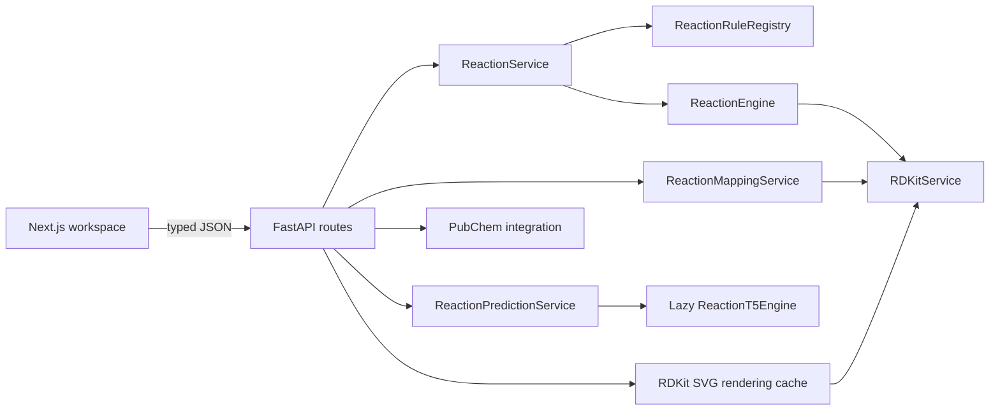

# ChemSearch

ChemSearch is a full-stack chemical reaction workbench for exploring two deliberately different workflows: transparent deterministic transformations and broader machine-learning prediction. A structure-first interface renders real RDKit molecule depictions, keeps SMILES available as secondary metadata, and exposes atom mapping and bond changes for rule-generated products.

> **Scope and safety:** ChemSearch is educational portfolio software. It is not a replacement for experimental evidence, professional cheminformatics software, or review by a qualified chemist.

## Interface

The desktop workspace uses three linked modes:

- **Simulate** applies a curated, deterministic SMARTS rule and reports its exact provenance.
- **Predict** runs `sagawa/ReactionT5v2-forward`, ranks unique valid candidate product sets, and lets the user select the candidate shown on the canvas.
- **Visualize** retains the latest simulation or selected ML candidate as a full reactant → product structure view.

The primary canvas is optimized for 2D structures, with reagents and conditions placed around the reaction arrow. The right rail contains product structures, relative model scores, warnings, atom-map counts, and bond-change summaries. The layout collapses for tablets and narrow screens.

## Architecture



The backend keeps API schemas, immutable domain models, orchestration services, chemistry infrastructure, and external integrations separate. Adding a deterministic transformation normally means registering a `ReactionRule`; it does not require editing the reaction engine.

## Technology

- Backend: Python 3.11, FastAPI, Pydantic, RDKit, PyTorch, Transformers, PubChem, pytest, Ruff
- Frontend: Next.js 16, React 19, TypeScript, Tailwind 4 availability, custom CSS
- Runtime: Docker Compose with a Linux backend to avoid Windows native RDKit policy conflicts
- CI: GitHub Actions for backend lint/tests, frontend lint/build, and container builds

## Supported deterministic transformations

| Reaction class | Curated rules | Notes |
|---|---|---|
| `hydrogenation` | Alkene hydrogenation | Non-aromatic C=C; excludes carbonyls |
| `alkene_halogenation` | Chlorination, bromination | Requires `ClCl` or `BrBr` in reagents |
| `alcohol_oxidation` | Primary → aldehyde, secondary → ketone | Narrow alcohol patterns |
| `carbonyl_reduction` | Aldehyde and ketone reduction | Carbonyl → alcohol |
| `esterification` | Fischer esterification | Carboxylic acid + alcohol; principal ester product |
| `ester_hydrolysis` | Simple ester cleavage | Acid and alcohol products |
| `nucleophilic_substitution` | Alkyl halide → alcohol | Simple alkyl Cl/Br/I substrates |

Rules model a constrained net transformation, not a complete mechanism or universally valid reaction scope. Ambiguous regioselective transformations are intentionally omitted.

## Simulation, mapping, and prediction

For simulation, RDKit applies each compatible registered SMARTS rule, canonicalizes products, and removes duplicate product sets. Each product set records the exact `rule_id` and rule name that generated it. Mapping reruns that same rule, finds the matching raw RDKit product set, maps atoms by their source identity, and classifies broken, formed, and bond-order changes.

Prediction uses `sagawa/ReactionT5v2-forward`. The adapter is lazy and process-scoped: application startup stays quick and the tokenizer/model are loaded once on the first prediction request. Beam outputs are validated with RDKit, canonicalized, deduplicated, ranked, and normalized across the remaining candidates. The displayed percentages are **relative confidence-like beam weights, not calibrated probabilities**. The model can generate chemically incorrect products.

## Run with Docker (recommended on Windows)

Install Docker Desktop, then from this directory run:

```bash
docker compose up --build
```

Open [http://localhost:3000](http://localhost:3000). The API and interactive documentation are at [http://127.0.0.1:8000/docs](http://127.0.0.1:8000/docs). The first ML prediction downloads the model into the persistent `reaction-models` volume and can take several minutes; subsequent runs reuse it.

This workflow does not require disabling Windows Smart App Control. RDKit runs inside the Linux backend container.

## Native development

Backend (Linux, WSL, or another environment where RDKit native modules are permitted):

```bash
cd backend
python -m venv .venv
source .venv/bin/activate
pip install -r requirements-dev.txt
uvicorn main:app --reload
```

Frontend, in another terminal:

```bash
cd frontend
cp .env.example .env.local
npm ci
npm run dev
```

The frontend uses `NEXT_PUBLIC_API_BASE_URL`, defaulting to `http://127.0.0.1:8000`. The backend accepts `FRONTEND_ORIGIN`, defaulting to `http://localhost:3000`.

## Public deployment

The repository is ready for a split deployment that keeps the portfolio demo reliable and easy to maintain:

1. Create a Docker Space named `chemsearch-api` on Hugging Face under the `manniiqbal` account.
2. Add a fine-grained Hugging Face write token to the GitHub repository as the `HF_TOKEN` Actions secret. An optional GitHub workflow can then sync only `backend/` to the Space after backend changes land on `main`.
3. Import the repository into Vercel and set the project root directory to `frontend`. Vercel will deploy the Next.js app on every push.
4. If the Vercel project uses a custom domain, set `FRONTEND_ORIGIN` on the Hugging Face Space to that exact origin. Vercel preview and production subdomains are already allowed through the backend origin pattern.
5. Optionally override `NEXT_PUBLIC_API_BASE_URL` in Vercel. Without an override, production builds use `https://manniiqbal-chemsearch-api.hf.space`.

The backend health check is available at `/health`; interactive API documentation is at `/docs`.

## API examples

Render a molecule:

```bash
curl -X POST http://127.0.0.1:8000/api/molecules/render \
  -H "Content-Type: application/json" \
  -d '{"smiles":"CCO","width":420,"height":280}'
```

Simulate hydrogenation:

```bash
curl -X POST http://127.0.0.1:8000/api/reactions/simulate \
  -H "Content-Type: application/json" \
  -d '{"reactants":[{"canonical_smiles":"C=C","coefficient":1}],"reaction_type":"hydrogenation"}'
```

Predict products:

```bash
curl -X POST http://127.0.0.1:8000/api/reactions/predict \
  -H "Content-Type: application/json" \
  -d '{"reactants":[{"canonical_smiles":"CCO","coefficient":1}],"reagents":[]}'
```

## Tests and quality checks

```bash
cd backend
pytest -q
ruff check .

cd ../frontend
npm run lint
npm run build
```

The real model smoke test is skipped by default to keep normal tests deterministic. Run it after the model is available with `RUN_MODEL_TESTS=1 pytest app/tests/test_reaction_t5_engine.py`.

## Infrastructure choices

PostgreSQL and Redis are intentionally omitted. The current product has no account model or durable history workflow, so a database would add operational weight without improving the three core tasks. The expensive deterministic rendering path already uses a bounded in-process SVG cache; the Hugging Face model cache is persisted as a Docker volume. A durable, searchable team reaction notebook would be the point at which PostgreSQL becomes justified, with Redis useful only after measured multi-worker cache pressure.

## Known limitations and future work

- Deterministic simulation covers only the listed curated classes and does not establish experimental feasibility, stereochemistry, selectivity, yield, equilibrium, or side products.
- Stoichiometric coefficients are metadata; the rule engine does not perform material balance calculations.
- ReactionT5 can be slow on CPU and may produce invalid or chemically implausible candidates.
- Relative beam scores are not calibrated probabilities.
- PubChem availability and rate limits affect molecule search.
- In-memory SVG caching is per backend process.
- Logical next steps are a reviewed stereochemistry-aware rule expansion, calibrated uncertainty evaluation, optional authenticated reaction history, GPU deployment, and end-to-end browser workflow tests.
